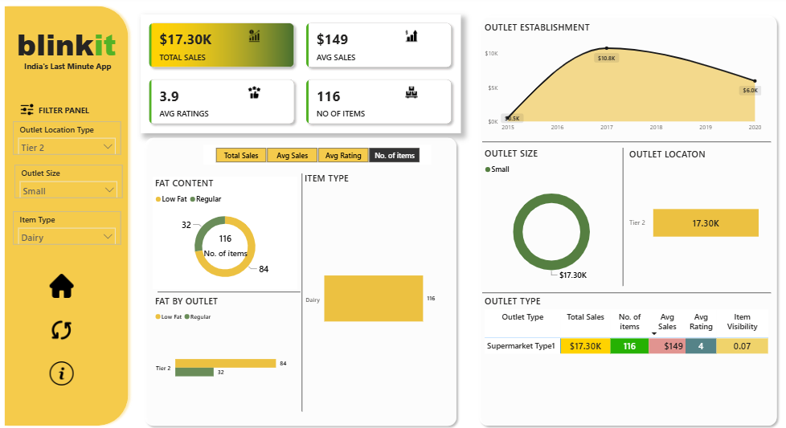

# Blinkit Sales Dashboard (Power BI)

## Overview

This project is an interactive Power BI dashboard developed to analyze Blinkit sales data. It provides insights into sales performance, product categories, customer behavior, and key business metrics using Power BI, DAX, and Power Query.

## Features

- Interactive dashboard
- KPI tracking
- Sales trend analysis
- Category-wise performance
- Product performance analysis
- Dynamic filters and slicers
- Data cleaning using Power Query
- DAX measures for business calculations

## Tools Used

- Microsoft Power BI
- Power Query
- DAX
- Microsoft Excel

## Key Metrics

- Total Sales
- Total Orders
- Total Profit
- Average Order Value
- Quantity Sold

## Project Structure

```
blinkit-sales-dashboard-powerbi/
│── Blinkit Sales Dashboard.pbix
│── Blinkit_Sales_Data.xlsx
│── README.md
└── images/
    └── dashboard.png
```

## Dashboard Preview



## How to Use

1. Download or clone the repository.
2. Open the `.pbix` file in Microsoft Power BI Desktop.
3. Refresh the dataset if required.
4. Explore the dashboard using the available filters.

## Author

Shivali Panchal

GitHub: https://github.com/shivaliii
